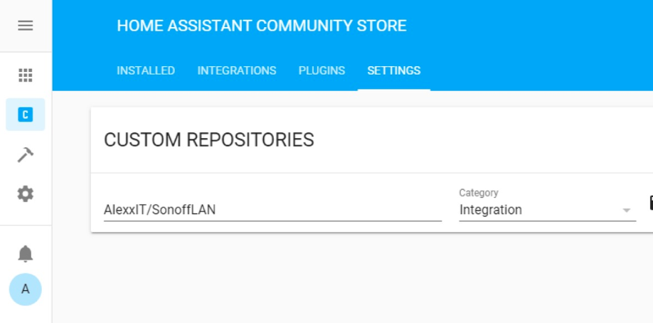

# Sonoff control from Home Assistant

[](https://www.buymeacoffee.com/AlexxIT)
[](https://money.yandex.ru/to/41001428278477)

- [Readme in Russian](README_ru.md)
- [Changelog in English](CHANGELOG.md)

Home Assistant Custom Component for control **eWeLink** (Sonoff) devices over Local Network (LAN).

Devices should have firmware v3+. LAN should support **Multicast** traffic.

Pros:

- work with original eWeLink/Sonoff firmware, no need to flash devices
- work over local network (LAN), no Cloud Server dependency
- work with devices without DIY-mode
- work with devices in DIY-mode
- support single and multi-channel devices
- support TH and POW device attributes
- support Sonoff RF Bridge 433 for receive and send commands
- instant device state update with Multicast
- (optional) load devices list from eWeLink Servers (with names, apikey/devicekey and device_class) and save it locally
- (optional) change device type (switch, light or fan)
- (optional) set multi-channel device as one light with brightness control

**Component review from DrZzs**

[](https://www.youtube.com/watch?v=DsTqOlrQQ1k)


## Tested Devices

- [Sonoff Basic](https://www.itead.cc/sonoff-wifi-wireless-switch.html)
- [Sonoff Mini](https://www.itead.cc/sonoff-mini.html) (no need use DIY-mode)
- [Sonoff TH](https://www.itead.cc/sonoff-th.html) (show temperature and humidity)
- [Sonoff 4CH Pro R2](https://www.itead.cc/sonoff-4ch-pro.html)
- [Sonoff Pow](https://www.itead.cc/sonoff-pow.html) (show power consumption)
- [Sonoff Micro](https://www.itead.cc/sonoff-micro-5v-usb-smart-adaptor.html)
- [Sonoff RF Bridge 433](https://www.itead.cc/sonoff-rf-bridge-433.html) (receive and send commands)
- [Sonoff D1](https://www.itead.cc/sonoff-d1-smart-dimmer-switch.html) (dimmer with brightness control)
- [Sonoff S55](https://www.itead.cc/sonoff-s55.html)
- [Sonoff T4EU1C](https://www.itead.cc/sonoff-t4eu1c-wi-fi-smart-single-wire-wall-switch.html)
- [Sonoff 5V DIY](https://www.aliexpress.com/item/32818293817.html)
- [MiniTiger Wall Switch](https://www.aliexpress.com/item/33016227381.html) (I have 8 without zero-line)
- [Sonoff Slampher R2](https://www.aliexpress.com/item/32864320127.html)

## Config Examples

Minimum config:

```yaml
sonoff:
  username: mymail@gmail.com
  password: mypassword
```

or

```yaml
sonoff:
  username: +910123456789  # important to use country code
  password: mypassword
```

Advanced config:

```yaml
sonoff:
  username: mymail@gmail.com
  password: mypassword
  reload: always  # update device list every time HA starts
  devices:
    1000abcdefg:
      device_class: light
```

Devices can be set manually, without connecting to Cloud Servers. But in this case, you need to know the `devicekey` for each device.

```yaml
sonoff:
  devices:
    1000abcdefg:
      devicekey: f9765c85-463a-4623-9cbe-8d59266cb2e4
```

Examples of using `device_class`:

```yaml
sonoff:
  username: mymail@gmail.com
  password: mypassword
  reload: once
  devices:
    1000abcde0: # corridor light
      device_class: light
    1000abcde1: # children's light (double switch, one light entity)
      device_class:
      - device_class: light
        channels: [1, 2]
    1000abcde2: # toilet light and fan (double switch)
      device_class: [light, fan]
    1000abcde3: # bedroom light and backlight (double switch)
      device_class: [light, light]
    1000abcde4: # hall three light zones Sonoff 4CH
      device_class:
      - light # zone 1 (channel 1)
      - light # zone 2 (channel 2)
      - device_class: light # zone 3 (channels 3 and 4)
        channels: [3, 4]
```

Minimum config for devices only in DIY mode:

```yaml
sonoff:
```

## Sonoff RF Bridge 433

Although the component supports training, it is recommended to train buttons through the eWeLink application.

The component can both send RF signals and receive them, but only previously trained.

When a command is received, the event `sonoff.remote` is generated with a button number and response time (in UTC, sends the device).

`command` - number of the button in the eWeLink application.


```yaml
automation:
- alias: Test RF
  trigger:
    platform: event
    event_type: sonoff.remote
    event_data:
      command: 0
  action:
    service: homeassistant.toggle
    entity_id: remote.sonoff_1000abcdefg

script:
  send_num1:
    sequence:
    - service: remote.send_command
      data:
        entity_id: remote.sonoff_1000abcdefg
        command: 1

  send_num111:
    sequence:
    - service: remote.send_command
      data:
        entity_id: remote.sonoff_1000abcdefg
        command: [1, 1, 1]
        delay_secs: 1
```

## Sonoff TH и Pow

Temperature, humidity and other parameters of the devices are stored in their attributes. They can be displayed through [Template](https://www.home-assistant.io/integrations/template/)-sensor.

```yaml
sensor:
- platform: template
  sensors:
    temperature_purifier:
      friendly_name: Temperature
      device_class: temperature
      value_template: "{{ state_attr('switch.sonoff_1000abcdefg', 'temperature') }}"
    humidity_purifier:
      friendly_name: Humidity
      device_class: humidity
      value_template: "{{ state_attr('switch.sonoff_1000abcdefg', 'humidity') }}"
```

## Parameters:

- **reload** - *optional*  
  `always` - load device list every time HA starts  
  `once` - (default) download device list once
- **device_class** - *optional*, overrides device type (default all **sonoff** devices are displayed as `switch`). May be a string or an array of strings (for multi-channel switches). Supports types: `light`, `fan`, `switch`, `remote` (only for *Sonoff RF Bridge 433*).


## Work with Cloud Servers

With `username` and` password` in the config (optional) - component loads list of devices from eWeLink Servers and save it in the file `/config/.sonoff.json` (hidden file).

The component does not make other requests to servers.

The list will be loaded only once. At the next start, the list will be loaded from the local file. When you have new **eWeLink** devices - manually delete the file and reboot the HA.

With `reload: always` in the config - the list will be loaded from servers at each start.

The list will be loaded from the local file even if you remove `username` and `password` from the settings.

## Getting devicekey manually

1. Put the device in setup mode
2. Connect to the Wi-Fi network `ITEAD-10000`, password` 12345678`
3. Open in browser `http://10.10.7.1/device`
4. Copy `deviceid` and `apikey` (this is `devicekey`)
5. Connect to your Wi-Fi network and setup Sonoff via the eWeLink app

## Demo

**Sonoff 4CH Pro R2**, configured as a single light source with brightness control.

[](https://www.youtube.com/watch?v=X7PcYfDy57A)

## HACS Support



## Component Debugging

```yaml
logger:
  default: info
  logs:
    custom_components.sonoff: debug
```

## Useful Links

- https://github.com/mattsaxon/sonoff-lan-mode-homeassistant
- https://blog.ipsumdomus.com/sonoff-switch-complete-hack-without-firmware-upgrade-1b2d6632c01
- https://github.com/itead/Sonoff_Devices_DIY_Tools/blob/master/SONOFF%20DIY%20MODE%20Protocol%20Doc%20v1.4.md
- https://github.com/peterbuga/HASS-sonoff-ewelink