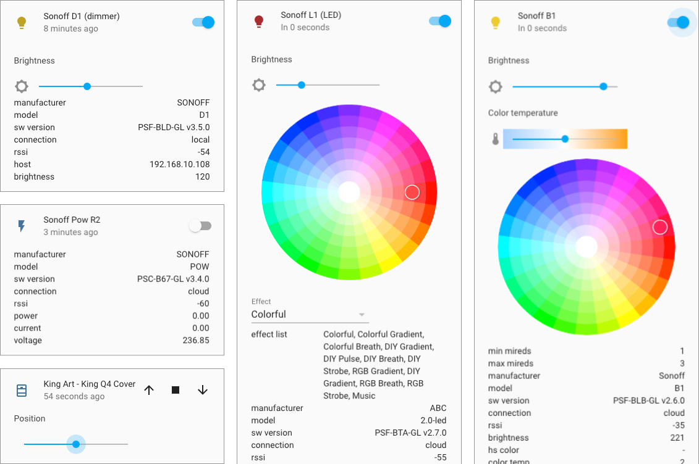
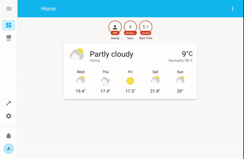
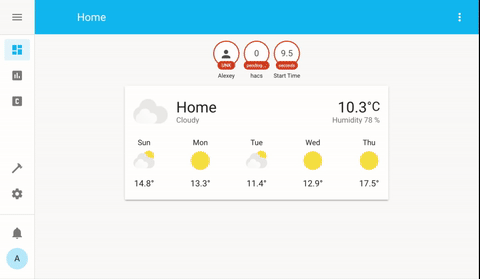
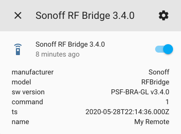
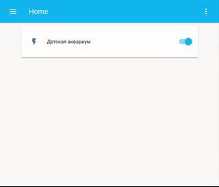

# Control Sonoff Devices from Home Assistant

[](https://github.com/custom-components/hacs)
[](https://www.buymeacoffee.com/AlexxIT)
[](https://money.yandex.ru/to/41001428278477)

Home Assistant custom component for control [Sonoff](https://www.itead.cc/) devices with [eWeLink](https://www.ewelink.cc/en/) (original) firmware over LAN and/or Cloud.

## Table of Contents

- [Main Info](#main-info)
- [Tested Devices](#tested-devices)
- [Install with HACS](#install-with-hacs)
- [Config Examples](#config-examples)
  - [Local and Cloud mode](#local-and-cloud-mode)
  - [Cloud only mode](#cloud-only-mode)
  - [Local mode with load config from Cloud](#local-mode-with-load-config-from-cloud)
  - [Local only mode (manual get devicekey)](#local-only-mode-manual-get-devicekey)
  - [Local only mode (DIY devices)](#local-only-mode-diy-devices)
  - [Custom device_class for any mode](#custom-device_class-for-any-mode)
  - [Refresh interval for TH and Pow](#refresh-interval-for-th-and-pow)
  - [Sensors from device attributes](#sensors-from-device-attributes)
- [Sonoff RF Bridge 433](#sonoff-rf-bridge-433)
  - [RF Bridge Sensors](#rf-bridge-sensors)
  - [RF Bridge Commands and Events](#rf-bridge-commands-and-events)
- [Sonoff Pow Power Consumption](#sonoff-pow-power-consumption)
- [Sonoff GK-200MP2-B Camera](#sonoff-gk-200mp2-b-camera)
- [Demo](#demo)
- [Getting devicekey manually](#getting-devicekey-manually)
- [Common problems in only LAN mode](#common-problems-in-only-lan-mode)
- [Component Debug Mode](#component-debug-mode)
- [Useful Links](#useful-links)

## Main Info

**New features in version 2.0:**

- can manage **both local and cloud control at the same time**!
- support old devices wih 2.7 firmware (only cloud connection)
- support new device types: color lights, sensors, covers
- support eWeLink cameras with PTZ ([read more](#sonoff-gk-200mp2-b-camera))
- support unavailable device state for both local and cloud connection 
- support refresh interval for Sonoff TH and Sonoff Pow ([read more](#refresh-interval-for-th-and-pow))
- support sensors for Sonoff RF Bridge 433 ([read more](#rf-bridge-sensors))
- support ZigBee Bridge and Devices
- added new debug mode for troubleshooting ([read more](#component-debug-mode))

**Breaking changes 2.0:** by default, both local and cloud modes will start working together. If you do not want this - enable the `mode: local` setting. But I recommend using the new mode, it works great.

If your internet breaks down - local management will continue to work.  
If you have problems with multicast on the local network - cloud management will work.  
If you want only local or only cloud control - this can also be configured.



Pros:

- work with original eWeLink / Sonoff firmware, no need to flash devices
- work over Local Network and / or Cloud Server ([read more](#local-and-cloud-mode))
- work with devices without DIY-mode
- work with devices in DIY-mode ([read more](#local-only-mode-diy-devices))
- support single and multi-channel devices
- support TH and Pow device attributes ([read more](#sonoff-th-and-pow))
- support Sonoff RF Bridge 433 for receive and send commands ([read more](#sonoff-rf-bridge-433))
- support Sonoff GK-200MP2-B Camera ([read more](#sonoff-gk-200mp2-b-camera))
- instant device state update with Local Multicast or Cloud Websocket connection
- load devices list from eWeLink Servers (with names, apikey/devicekey and device_class) and save it locally
- (optional) change device type from `switch` to `light` ([read more](#custom-device_class-for-any-mode))
- (optional) config force refresh interval for TH and Pow ([read more](#refresh-interval-for-th-and-pow))

**Component review from DrZzs**

[](https://www.youtube.com/watch?v=DsTqOlrQQ1k)

There is another great component by [@peterbuga](https://github.com/peterbuga/HASS-sonoff-ewelink), that works with cloud servers.

Thanks to [@beveradb](https://github.com/beveradb/sonoff-lan-mode-homeassistant) and [@mattsaxon](https://github.com/mattsaxon/sonoff-lan-mode-homeassistant) for researching the local Sonoff protocol.  
Thanks to [@michthom](https://github.com/michthom) and [@EpicLPer](https://github.com/EpicLPer) for researching the local Sonoff Camera protocol.

## Tested Devices

**Tested (only LAN)**

Maybe other eWeLink cameras also work, I don’t know.

- [Camera GK-100CD10B](https://www.gearbest.com/smart-home-controls/pp_009678072743.html) (camera with PTZ)
- [Sonoff GK-200MP2-B](https://www.itead.cc/sonoff-gk-200mp2-b-wi-fi-wireless-ip-security-camera.html) (camera with PTZ)

**Tested (LAN and Cloud)**

These devices work both on a local network and through the cloud.

- [Sonoff Basic](https://www.itead.cc/sonoff-wifi-wireless-switch.html) fw 3.0.1
- [Sonoff Basic R3](https://www.itead.cc/sonoff-basicr3-wifi-diy-smart-switch.html)
- [Sonoff RFR3](https://www.itead.cc/sonoff-rfr3.html)
- [Sonoff Mini](https://www.itead.cc/sonoff-mini.html) (no need use DIY-mode) fw 3.3.0
- [Sonoff TH](https://www.itead.cc/sonoff-th.html) (show temperature and humidity) fw 3.4.0
- [Sonoff 4CH Pro R2](https://www.itead.cc/sonoff-4ch-pro.html) fw 3.3.0
- [Sonoff Pow R2](https://www.itead.cc/sonoff-pow-r2.html) (show power consumption)
- [Sonoff Micro](https://www.itead.cc/sonoff-micro-5v-usb-smart-adaptor.html) fw 3.4.0
- [Sonoff RF Bridge 433](https://www.itead.cc/sonoff-rf-bridge-433.html) (receive and send commands) fw 3.3.0, 3.4.0
- [Sonoff D1](https://www.itead.cc/sonoff-d1-smart-dimmer-switch.html) (dimmer with brightness control) fw 3.4.0, 3.5.0
- [Sonoff Dual](https://www.itead.cc/sonoff-dual.html)
- [Sonoff iFan02](https://www.itead.cc/sonoff-ifan02-wifi-smart-ceiling-fan-with-light.html) (light and fan with speed control) fw 3.3.0
- [Sonoff iFan03](https://www.itead.cc/sonoff-ifan03-wifi-ceiling-fan-light-controller.html) (light and fan with speed control) fw 3.4.0
- [Sonoff S20](https://www.itead.cc/smart-socket.html)
- [Sonoff S26](https://www.itead.cc/sonoff-s26-wifi-smart-plug.html)
- [Sonoff S31](https://www.itead.cc/sonoff-s31.html) (show power consumption)
- [Sonoff S55](https://www.itead.cc/sonoff-s55.html)
- [Sonoff SV](https://www.itead.cc/sonoff-sv.html) fw 3.0.1
- [Sonoff T1](https://www.itead.cc/sonoff-t1.html)
- [Sonoff TX](https://www.itead.cc/sonoff-tx-series-wifi-smart-wall-switches.html)
- [Sonoff T4EU1C](https://www.itead.cc/sonoff-t4eu1c-wi-fi-smart-single-wire-wall-switch.html)
- [Sonoff Slampher R2](https://www.itead.cc/sonoff-slampher-r2.html)
- [Sonoff 5V DIY](https://www.aliexpress.com/item/32818293817.html)
- [Sonoff RE5V1C](https://www.itead.cc/sonoff-re5v1c.html)
- [MiniTiger Wall Switch](https://www.aliexpress.com/item/33016227381.html) (I have 8 without zero-line) fw 3.3.0
- [Smart Circuit Breaker](https://www.aliexpress.com/item/4000454408211.html)
- [Smart Circuit Breaker](https://www.aliexpress.com/item/4000351300288.html)
- [Smart Circuit Breaker](https://www.aliexpress.com/item/4000077475264.html)
- [Smart Timer Switch](https://www.aliexpress.com/item/4000189016383.html)
- [Eachen WiFi Smart Touch](https://ewelink.eachen.cc/product/eachen-single-live-wall-switch-us-ac-l123ewelink-app/) fw 3.3.0

**Tested (only Cloud)**

These devices only work through the cloud!

- [Sonoff L1](https://www.itead.cc/sonoff-l1-smart-led-light-strip.html) (color, brightness, effects) fw 2.7.0
- [Sonoff B1](https://www.itead.cc/sonoff-b1.html) (color, brightness, color temp) fw 2.6.0
- [Sonoff SC](https://www.itead.cc/sonoff-sc.html) (five sensors) fw 2.7.0
- [Sonoff DW2](https://www.itead.cc/sonoff-dw2.html)
- [King Art - King Q4 Cover](https://www.aliexpress.com/item/32956776611.html) (pause, position) fw 2.7.0
- [KING-M4](https://www.aliexpress.com/item/33013358523.html) (brightness) fw 2.7.0
- [Eachen WiFi Door/Window Sensor](https://ewelink.eachen.cc/product/eachen-wifi-smart-door-window-sensor-wdw-ewelink/)
- [Essential Oils Diffuser](https://www.amazon.co.uk/dp/B07WF7MQ17) (fan and color light) fw 2.9.0
- [Smart USB Mosquito Killer](https://www.aliexpress.com/item/33037963105.html)
- [Smart Bulb RGB+CCT](https://www.aliexpress.com/item/4000764330397.html)

**Tested ZigBee (only Cloud)**

- [Sonoff ZigBee Bridge](https://www.itead.cc/sonoff-zbbridge.html) - turn on for pairing mode
- SONOFF SNZB-01 - Zigbee Wireless Switch
- SONOFF SNZB-02 - ZigBee Temperature and Humidity Sensor
- SONOFF SNZB-03 - ZigBee Motion Sensor
- SONOFF SNZB-04 - ZigBee Wireless door/window sensor

## Install with HACS

Latest [HACS](https://hacs.xyz/) require HA 0.110.0 or newer:



Old HACS:



Or manually copy `sonoff` folder from [latest release](https://github.com/AlexxIT/SonoffLAN/releases/latest) to `custom_components` folder in your config folder.

## Config Examples

Cloud mode **cannot work simultaneously** with the 3rd version eWeLink mobile application. You need:
- eWeLink application of the 4th version (Android only)  
- create a second account, share devices with it and use it in the component

Cloud mode **cannot work simultaneously** with two copies of component (example main and test Home Assistant). You need:
- create a second account, share devices with it and use it in the second Home Assistant

Local only mode users fine.

Local mode with load device list - break authorization in a mobile application only at the start of Home Assistant.

### Local and Cloud mode

Recommended for general user.

For devices **on the 3rd firmware version in the same local network with a working multicast**, it uses both local and cloud connections simultaneously.

In other cases, it uses **only a cloud connection**:
- devices on the 2nd firmware version
- devices on another LAN / VLAN
- users with problems setting up multicast traffic
- when the local connection freezes (yes it happens)

```yaml
sonoff:
  username: mymail@gmail.com
  password: mypassword
```

or

```yaml
sonoff:
  username: +910123456789  # important to use country code
  password: mypassword
```

If you have Sonoff Pow or Sonoff TH, you might want to use this kind of config:

```yaml
sonoff:
  username: mymail@gmail.com
  password: mypassword
  force_update: [temperature, power]
  scan_interval: '00:05:00'  # (optional) default 5 minutes
  sensors: [temperature, humidity, power, current, voltage]
```

Read below what it means.

### Cloud only mode

Recommended for users with a bad router, which may freeze due to multicast traffic.

```yaml
sonoff:
  username: mymail@gmail.com
  password: mypassword
  mode: cloud
```

### Local mode with load config from Cloud

Legacy mode. Only downloads a list of devices from Cloud Servers. Works with local protocol. Only works with devices on 3rd firmware.

```yaml
sonoff:
  username: mymail@gmail.com
  password: mypassword
  mode: local
  reload: always  # update device list every time HA starts
```

Component loads list of devices from eWeLink Servers and save it in the file `/config/.sonoff.json` (hidden file).

The list will be loaded only once. At the next start, the list will be loaded from the local file. When you have new **eWeLink** devices - manually delete the file and reboot the HA.

With `reload: always` in the config - the list will be loaded from servers at each start.

The list will be loaded from the local file even if you remove `username` and `password` from the settings.

### Local only mode (manual get devicekey)

I don’t understand who needs it, but you never know. You must manually get devicekey for each device. Only works with devices on 3rd firmware.

```yaml
sonoff:
  devices:
    1000abcdefg:
      devicekey: f9765c85-463a-4623-9cbe-8d59266cb2e4
```

### Local only mode (DIY devices)

Recommended for users who do not trust Cloud Servers for some reason. Only works with devices in DIY mode.

```yaml
sonoff:
```

### Custom device_class for any mode

You can convert all switches into light by default:

```yaml
sonoff:
  default_class: light  # (optional), default switch
```

You can convert specific switches into lights or fans:

```yaml
sonoff:
  devices:
    1000abcde0:
      device_class: light
      name: Sonoff Basic
    1000abcde1:
      device_class: fan
      name: Sonoff Mini
```

You can convert multi-channel devices (e.g. Sonoff T1 2C):

```yaml
sonoff:
  devices:
    1000abcde2:
      device_class: [light, fan]
      name: Sonoff T1 2C
    1000abcde3:
      device_class: [light, light]
      name: MiniTiger 2CH
```

You can convert multi-channel device (e.g. Sonoff T1 3C) into single light with brightness control:

```yaml
sonoff:
  devices:
    1000abcde4:
      device_class:
        - light: [1, 2, 3]
      name: Sonoff T1 3C
```

You can control multiple light zones with single multi-channel device (e.g. Sonoff 4CH Pow):

```yaml
sonoff:
  devices:
    1000abcde5:
      device_class:
        - light  # zone 1 (channel 1)
        - light  # zone 2 (channel 2)
        - light: [3, 4]  # zone 3 (channels 3 and 4)
      name: Sonoff 4CH Pow
```

You can change `device_class` for Door Sensor:

```yaml
sonoff:
  devices:
    1000abcde6:
      device_class: window
```

You can skip importing any cloud devices:

```yaml
sonoff:
  devices:
    1000abcde7:
      device_class: exclude
```

### Refresh interval for TH and Pow

You can config forced updating of TH and Pow attributes ([read more](https://github.com/AlexxIT/SonoffLAN/issues/14)).

**Force update device by attribute**

It is not necessary to list all the attributes of each device (e.g. `temperature` and `humidity`). Only one is enough.

```yaml
sonoff:
  force_update: [temperature, power]
  scan_interval: '00:05:00'  # (optional) default 5 minutes
```

**Force update device by deviceid**

```yaml
sonoff:
  scan_interval: '00:05:00'  # (optional) default 5 minutes
  devices:
    1000abcde0:
      name: Sonoff TH
      force_update: True
    1000abcde1:
      name: Sonoff Pow
      force_update: True
```

### Sensors from device attributes

Temperature and power sensors are not created by default!  
You can list all the attributes you want to see as sensors.

```yaml
sonoff:
  sensors: [temperature, humidity, power, current, voltage, rssi]
```

## Sonoff RF Bridge 433

**Video HOWTO from @KPeyanski**

[](https://www.youtube.com/watch?v=QD1K7s01cak?t=284)

Video HOWTO from me in [Demo](#demo) section.

### RF Bridge Sensors

You can config sensors for your RF Bridge.

The PIR sensor sends a signal if it detects motion. The door / window sensor sends a signal when open. You can set the time after which the sensor goes into off state. Default 120 seconds.

If you has door sensor with two states (for open and for closed state) like [this one](https://www.banggood.com/10Pcs-GS-WDS07-Wireless-Door-Magnetic-Strip-433MHz-for-Security-Alarm-Home-System-p-1597356.html?cur_warehouse=CN), you can config `payload_off` as in the example below. Also disable the timeout if you do not need it in this case (with `timeout: 0` option).

You can use any `device_class` that is supported in [Binary Sensor](https://www.home-assistant.io/integrations/binary_sensor/).

**PIR Sensor**

```yaml
sonoff:
  rfbridge:
    PIR Sensor 1:  # sensor name in eWeLink application
      device_class: motion
      timeout: 60  # optional (default 120), timeout in seconds for auto turn off
    PIR Sensor 2:  # sensor name in eWeLink application
      device_class: motion
      timeout: 60  # optional (default 120), timeout in seconds for auto turn off
```

**Single State Sensor**

```yaml
sonoff:
  rfbridge:
    Door Sensor 1:  # sensor name in eWeLink application
      name: Door Sensor # optional, you can change sensor name
      device_class: door  # e.g. door, window
      timeout: 5
    Door Sensor 2:
      name: Door Sensor
      device_class: door
      timeout: 5
```

**Dual State Sensor**

```yaml
sonoff:
  rfbridge:
    Button1:  # button name in eWeLink application (open signal)
      name: Window Sensor  # optional, you can change sensor name
      device_class: window  # e.g. door, window
      timeout: 0  # disable auto close timeout
      payload_off: Button2  # button name in eWeLink application (close signal)
    Button3:
      name: Window Sensor
      device_class: window
      timeout: 0
      payload_off: Button4
```

### RF Bridge Commands and Events

Component will create only one entity per RF Bridge - `remote.sonoff_1000abcdefg`.

You can receive signals from RF Buttons and RF Sensors through an event `sonoff.remote`. And send signals using the service `remote.send_command`.

Although the component supports training, it is recommended to train RF Buttons through the eWeLink application.

When a command is received, the event `sonoff.remote` is generated with a button number and response time (in UTC, sends the device).

The last command received can be seen in the Bridge attributes:



**Example for receive all RF signal**

```yaml
automation:
- alias: Sonoff RF Receive
  trigger:
    platform: event
    event_type: sonoff.remote  # this is NOT entity_id, don't change it!
  action:
    service: persistent_notification.create
    data_template:
      title: Sonoff RF Receive
      message: |-
        Name: {{ trigger.event.data.name }}
        Command: {{ trigger.event.data.command }}
        Time: {{ trigger.event.data.ts }}
```

**Example of reaction to the selected button**

Instead of a `name: Button1`, you can use `command: 0` number of the button in the eWeLink application (starts from zero).

```yaml
automation:
- alias: Receive Button1
  trigger:
    platform: event
    event_type: sonoff.remote  # this is NOT entity_id, don't change it!
    event_data:
      name: Button1  # button/sensor name in eWeLink application
  action:
    service: persistent_notification.create
    data:
      message: My Remote button pressed
```

**Example for send RF signal**

```yaml
script:
  send_button1:
    alias: Send RF Button1
    sequence:
    - service: remote.send_command
      data:
        entity_id: remote.sonoff_1000abcdef
        command: Button1  # button name in eWeLink application
```

## Sonoff Pow Power Consumption

For update power consumption of all your Pow devices you can call `sonoff.update_consumption` service.

The device attributes will display data for the last 100 days. The first element is today's data. It's up to you how often to call updates and what to do with this data later.

Remember, without calling the service, there will be no values. Use automation.

```yaml
sensor:
- platform: template
  sensors:
    today_consumption:
      friendly_name: Today consumpion
      unit_of_measurement: kWh
      value_template: "{{ state_attr('switch.sonoff_1000abcdef', 'consumption').0 }}"
    ten_days_consumption:
      friendly_name: 10 days consumpion
      unit_of_measurement: kWh
      value_template: "{{ p[:10]|sum if p }}"
```

## Sonoff GK-200MP2-B Camera

Currently only PTZ commands are supported. Camera entity is not created now.

You can send `left`, `right`, `up`, `down` commands with `sonoff.send_command` service:

```yaml
script:
  left:
    sequence:
      - service: sonoff.send_command
        data:
          device: '012345'  # use quotes, this is important
          cmd: left
```

`device` - this is the number from the camera ID `EWLK-012345-XXXXX`, exactly 6 digits (leading zeros - it is important).

**Never ever tell anyone your camera ID!**

*In development: camera entity with still image and stream support.*

## Demo

Check other videos on my [YouTube](https://www.youtube.com/c/AlexxIT) channel.

**Sonoff RF Bridge automation via Node-RED**

[](https://www.youtube.com/watch?v=DhYIjEOtZ_I)

**Control Sonoff 4CH Pow R2 from HomeKit**

[](https://www.youtube.com/watch?v=X7PcYfDy57A) [](https://www.youtube.com/watch?v=TnFS7qWgKoo)

Change **Name** or **Entity ID** of any device: 



## Getting devicekey manually

1. Put the device in setup mode
2. Connect to the Wi-Fi network `ITEAD-10000`, password` 12345678`
3. Open in browser `http://10.10.7.1/device`
4. Copy `deviceid` and `apikey` (this is `devicekey`)
5. Connect to your Wi-Fi network and setup Sonoff via the eWeLink app

## Common problems in only LAN mode

Cloud users don't have these problems.

**Devices are not displayed**

1. Only supported devices with firmware v3+
2. Common problems with Multicast:
   - two routers
   - **docker** with port forwarding
     - The devices publish their services through mDNS (See http://developers.sonoff.tech/sonoff-diy-mode-api-protocol.html#Device-mDNS-Service-Info-Publish-Process). For this to wourk through docker, you must use the `host` mode for the network! (See https://docs.docker.com/network/network-tutorial-host)
     - hassio users are okay
   - **virtual machine** with port forwarding
     - you must use bridge virtual network mode (not NAT mode)
   - Oracle VM VirtualBox
   - linux firewall
   - linux network driver

**Devices unavailable after reboot**

All devices **unavailable** after each Home Assistant restart. It does not depend on `reload` setting. Devices are automatically detected in the local network after each restart. Sometimes devices appear quickly. Sometimes after a few minutes. If this does not happen, there are some problems with the multicast / router.

## Component Debug Mode

Component support debug mode. Shows only component logs and removes all private data automatically. The link to the logs is always random.

[](https://www.youtube.com/watch?v=Lt5fT4N5Pm8)

```yaml
sonoff:
  username: mymail@gmail.com
  password: mypassword
  debug: True  # you will get HA notification with a link to the logs page
```

You can filter multiple devices in the logs and enable auto refresh (in seconds).

```
http://192.168.1.123:8123/c4e99cfc-0c83-4a39-b7f0-278b0e719bd1?q=1000abcde1|1000abcde2&r=2
```

All unknown devices with command `switch` support will be added as `switch`.

All other unknown devices will be added as `binary_sensor` (always `off`). The full state of the device is displayed in its attributes.

The component adds the service `sonoff.send_command` to send low-level commands.

Example service params to single switch:

```yaml
device: 1000123456
switch: 'on'
```

Example service params to multi-channel switch:

```yaml
device: 1000123456
switches: [{outlet: 0, switch: 'off'}]
```

Example service params to dimmer:

```yaml
device: 1000123456
cmd: dimmable
switch: 'on'
brightness: 50
mode: 0
```

## Useful Links

- https://github.com/peterbuga/HASS-sonoff-ewelink
- https://github.com/beveradb/sonoff-lan-mode-homeassistant
- https://github.com/mattsaxon/sonoff-lan-mode-homeassistant
- https://github.com/EpicLPer/Sonoff_GK-200MP2-B_Dump
- https://blog.ipsumdomus.com/sonoff-switch-complete-hack-without-firmware-upgrade-1b2d6632c01
- https://github.com/itead/Sonoff_Devices_DIY_Tools/blob/master/SONOFF%20DIY%20MODE%20Protocol%20Doc%20v1.4.md
- [SONOFF DIY MODE API PROTOCOL](http://developers.sonoff.tech/sonoff-diy-mode-api-protocol.html)
- [No Tasmota And EWeLink Cloud To Control The SONOFF Device? YES!](https://sonoff.tech/product-tutorials/diy-mode-to-control-the-sonoff-device)
