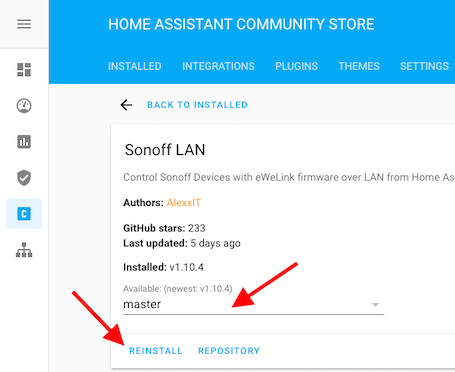

# Sonoff control from Home Assistant

[](https://github.com/custom-components/hacs)
[](https://www.buymeacoffee.com/AlexxIT)
[](https://money.yandex.ru/to/41001428278477)

Home Assistant Custom Component for control **eWeLink** (Sonoff) devices.

By default all users get latest stable release: [1.10.4](https://github.com/AlexxIT/SonoffLAN/tree/v1.10.4)

**OPEN BETA TEST BIG NEW VERSION** of component - [more details](https://github.com/AlexxIT/SonoffLAN/issues/99)  
Can manage **both local and cloud control at the same time**!  



If your internet breaks down - local management will continue to work.  
If you have problems with multicast on the local network - cloud management will work.  
If you want only local or only cloud control - this can also be configured.


Pros:

- work with original eWeLink / Sonoff firmware, no need to flash devices
- work over Local Network and / or Cloud Server
- work with devices without DIY-mode
- work with devices in DIY-mode
- support single and multi-channel devices
- support TH and POW device attributes
- support Sonoff RF Bridge 433 for receive and send commands
- instant device state update with Local Multicast or Cloud Websocket connection
- load devices list from eWeLink Servers (with names, apikey/devicekey and device_class) and save it locally
- (optional) change device type (`switch`, `light` or `fan`)
- (optional) set multi-channel device as single light with brightness control

**Component review from DrZzs (HOWTO about HACS)**

[](https://www.youtube.com/watch?v=DsTqOlrQQ1k)

There is another great component by [@peterbuga](https://github.com/peterbuga/HASS-sonoff-ewelink), that works with cloud servers.

Thanks to these people [@beveradb](https://github.com/beveradb/sonoff-lan-mode-homeassistant), [@mattsaxon](https://github.com/mattsaxon/sonoff-lan-mode-homeassistant) for researching the local Sonoff protocol.

## Tested Devices (LAN mode)

These devices work both on a local network and through the cloud.

- [Sonoff Basic](https://www.itead.cc/sonoff-wifi-wireless-switch.html) fw 3.0.1
- [Sonoff Basic R3](https://www.itead.cc/sonoff-basicr3-wifi-diy-smart-switch.html)
- [Sonoff Mini](https://www.itead.cc/sonoff-mini.html) (no need use DIY-mode) fw 3.3.0
- [Sonoff TH](https://www.itead.cc/sonoff-th.html) (show temperature and humidity) fw 3.4.0
- [Sonoff 4CH Pro R2](https://www.itead.cc/sonoff-4ch-pro.html) fw 3.3.0
- [Sonoff Pow R2](https://www.itead.cc/sonoff-pow-r2.html) (show power consumption)
- [Sonoff Micro](https://www.itead.cc/sonoff-micro-5v-usb-smart-adaptor.html) fw 3.4.0
- [Sonoff RF Bridge 433](https://www.itead.cc/sonoff-rf-bridge-433.html) (receive and send commands) fw 3.3.0, 3.4.0
- [Sonoff D1](https://www.itead.cc/sonoff-d1-smart-dimmer-switch.html) (dimmer with brightness control) fw 3.4.0, 3.5.0
- [Sonoff Dual](https://www.itead.cc/sonoff-dual.html)
- [Sonoff iFan02](https://www.itead.cc/sonoff-ifan02-wifi-smart-ceiling-fan-with-light.html) (light and fan with speed control) fw 3.3.0
- [Sonoff iFan03](https://www.itead.cc/sonoff-ifan03-wifi-ceiling-fan-light-controller.html) (light and fan with speed control) fw 3.4.0
- [Sonoff S20](https://www.itead.cc/smart-socket.html)
- [Sonoff S26](https://www.itead.cc/sonoff-s26-wifi-smart-plug.html)
- [Sonoff S31](https://www.itead.cc/sonoff-s31.html) (show power consumption)
- [Sonoff S55](https://www.itead.cc/sonoff-s55.html)
- [Sonoff SV](https://www.itead.cc/sonoff-sv.html) fw 3.0.1
- [Sonoff TX](https://www.itead.cc/sonoff-tx-series-wifi-smart-wall-switches.html)
- [Sonoff T4EU1C](https://www.itead.cc/sonoff-t4eu1c-wi-fi-smart-single-wire-wall-switch.html)
- [Sonoff Slampher R2](https://www.itead.cc/sonoff-slampher-r2.html)
- [Sonoff 5V DIY](https://www.aliexpress.com/item/32818293817.html)
- [MiniTiger Wall Switch](https://www.aliexpress.com/item/33016227381.html) (I have 8 without zero-line) fw 3.3.0
- [Smart Circuit Breaker](https://www.aliexpress.com/item/4000454408211.html)
- [Smart Circuit Breaker](https://www.aliexpress.com/item/4000351300288.html)

## Tested Devices (only Cloud mode)

These devices only work through the cloud!

- [Sonoff L1](https://www.itead.cc/sonoff-l1-smart-led-light-strip.html) (color, brightness, effects) fw 2.7.0
- [Sonoff B1](https://www.itead.cc/sonoff-b1.html) (color, brightness, color temp) fw 2.6.0
- [King Art - King Q4 Cover](https://www.aliexpress.com/item/32956776611.html) (pause, position) fw 2.7.0
- [KING-M4](https://www.aliexpress.com/item/33013358523.html) (brightness) fw 2.7.0

## Config Examples

Cloud mode **cannot work simultaneously** with the 3rd version eWeLink mobile application. You need:
- eWeLink application of the 4th version (Android only)  
- create a second account, share devices with it and use it in the component

Cloud mode **cannot work simultaneously** with two copies of component (example main and test Home Assistant). You need:
- create a second account, share devices with it and use it in the second Home Assistant

Local only mode users fine.

Local mode with load device list - break authorization in a mobile application only at the start of Home Assistant.

### Local and Cloud mode

Recommended for general user.

For devices **on the 3rd firmware version in the same local network with a working multicast**, it uses both local and cloud connections simultaneously.

In other cases, it uses **only a cloud connection**:
- devices on the 2nd firmware version
- devices on another LAN / VLAN
- users with problems setting up multicast traffic
- when the local connection freezes (yes it happens)

```yaml
sonoff:
  username: mymail@gmail.com
  password: mypassword
```

or

```yaml
sonoff:
  username: +910123456789  # important to use country code
  password: mypassword
```

### Cloud only mode

Recommended for users with a bad router, which may freeze due to multicast traffic.

```yaml
sonoff:
  username: mymail@gmail.com
  password: mypassword
  mode: cloud
```

### Local mode with load device list from Cloud Servers

Legacy mode. Only downloads a list of devices from Cloud Servers. Works with local protocol. Only works with devices on 3rd firmware.

```yaml
sonoff:
  username: mymail@gmail.com
  password: mypassword
  mode: local
  reload: always  # update device list every time HA starts
```

Component loads list of devices from eWeLink Servers and save it in the file `/config/.sonoff.json` (hidden file).

The list will be loaded only once. At the next start, the list will be loaded from the local file. When you have new **eWeLink** devices - manually delete the file and reboot the HA.

With `reload: always` in the config - the list will be loaded from servers at each start.

The list will be loaded from the local file even if you remove `username` and `password` from the settings.

### Local only mode (manual get devicekey)

I don’t understand who needs it, but you never know. You must manually get devicekey for each device. Only works with devices on 3rd firmware.

```yaml
sonoff:
  devices:
    1000abcdefg:
      devicekey: f9765c85-463a-4623-9cbe-8d59266cb2e4
```

### Local only mode (DIY devices)

Recommended for users who do not trust Cloud Servers for some reason. Only works with devices in DIY mode.

```yaml
sonoff:
```

### Advanced config for ANY MODE

Examples of using `device_class`:

```yaml
sonoff:
  username: mymail@gmail.com
  password: mypassword
  default_class: light  # changes the default class of all devices from switch to light
  devices:
    1000abcde0:  # corridor light
      device_class: light
      name: My Best Light  # yes, you can set name from yaml
    1000abcde1:  # children's light (converts multi-channel device into single light entity)
      device_class:
      - light: [1, 2]
    1000abcde2:  # toilet light and fan (double switch)
      device_class: [light, fan]
    1000abcde3:  # bedroom light and backlight (double switch)
      device_class: [light, light]
    1000abcde4:  # hall three light zones Sonoff 4CH
      device_class:
      - light  # zone 1 (channel 1)
      - light  # zone 2 (channel 2)
      - light: [3, 4]  # zone 3 (channels 3 and 4)
```

## Sonoff RF Bridge 433

**Video HOWTO from @KPeyanski**

Install from [HACS](https://hacs.xyz/), automation and event trigger:

[](https://www.youtube.com/watch?v=QD1K7s01cak?t=284)

Component will create only one entity per RF Bridge - `remote.sonoff_1000abcdefg`. Entity RF Buttons or RF Sensors are not created!

You can receive signals from RF Buttons and RF Sensors through an event `sonoff.remote`. And send signals using the service `remote.send_command`.

Although the component supports training, it is recommended to train RF Buttons through the eWeLink application.

When a command is received, the event `sonoff.remote` is generated with a button number and response time (in UTC, sends the device).

`command` - number of the button in the eWeLink application.

Example for receive RF signal via [Automation](https://www.home-assistant.io/integrations/automation/):

```yaml
automation:
- alias: Receive RF Button1
  trigger:
    platform: event
    event_type: sonoff.remote
    event_data:
      name: Button1  # button/sensor name in eWeLink application
  action:
    service: homeassistant.toggle
    entity_id: switch.sonoff_1000abcdefg
```

Example for send RF signal via [Script](https://www.home-assistant.io/integrations/script/):

```yaml
script:
  send_button1:
    alias: Send RF Button1
    sequence:
    - service: remote.send_command
      data:
        entity_id: remote.sonoff_1000abcdefg
        command: Button1  # button name in eWeLink application
```

## Sonoff TH и Pow

Temperature, humidity and other parameters of the devices are stored in their attributes. They can be displayed through [Template](https://www.home-assistant.io/integrations/template/)-sensor.

```yaml
sensor:
- platform: template
  sensors:
    temperature_th:
      friendly_name: Temperature
      device_class: temperature
      value_template: "{{ state_attr('switch.sonoff_1000abcdefg', 'temperature') }}"
    humidity_th:
      friendly_name: Humidity
      device_class: humidity
      value_template: "{{ state_attr('switch.sonoff_1000abcdefg', 'humidity') }}"
```

## Demo

**Sonoff 4CH Pro R2**, configured as a single light source with brightness control.

[](https://www.youtube.com/watch?v=X7PcYfDy57A)

Change **Name** or **Entity ID** of any device: 


Install with [HACS](https://hacs.xyz/)


## Getting devicekey manually

1. Put the device in setup mode
2. Connect to the Wi-Fi network `ITEAD-10000`, password` 12345678`
3. Open in browser `http://10.10.7.1/device`
4. Copy `deviceid` and `apikey` (this is `devicekey`)
5. Connect to your Wi-Fi network and setup Sonoff via the eWeLink app

## Common problems in only LAN mode

Cloud users don't have these problems.

**Devices are not displayed**

1. Only supported devices with firmware v3+
2. Common problems with Multicast:
   - two routers
   - **docker** with port forwarding
     - you must use: [--network host](https://docs.docker.com/network/network-tutorial-host/)
     - hassio users are okay
   - **virtual machine** with port forwarding
     - you must use bridge virtual network mode (not NAT mode)
   - Oracle VM VirtualBox
   - linux firewall
   - linux network driver

**Devices unavailable after reboot**

All devices **unavailable** after each Home Assistant restart. It does not depend on `reload` setting. Devices are automatically detected in the local network after each restart. Sometimes devices appear quickly. Sometimes after a few minutes. If this does not happen, there are some problems with the multicast / router.

## Component Debugging

Add to your `configuration.yaml`:

```yaml
logger:
  default: info
  logs:
    custom_components.sonoff: debug
```

All unknown devices with command `switch` support will be added as `switch`.

All other unknown devices will be added as `binary_sensor` (always `off`). The full state of the device is displayed in its attributes.

The component adds the service `sonoff.send_command` to send low-level commands.

Example service params to single switch:

```yaml
device: 1000123456
switch: 'on'
```

Example service params to multi-channel switch:

```yaml
device: 1000123456
switches: [{outlet: 0, switch: 'off'}]
```

Example service params to dimmer:

```yaml
device: 1000123456
cmd: dimmable
switch: 'on'
brightness: 50
mode: 0
```

## Useful Links

- https://github.com/peterbuga/HASS-sonoff-ewelink
- https://github.com/beveradb/sonoff-lan-mode-homeassistant
- https://github.com/mattsaxon/sonoff-lan-mode-homeassistant
- https://blog.ipsumdomus.com/sonoff-switch-complete-hack-without-firmware-upgrade-1b2d6632c01
- https://github.com/itead/Sonoff_Devices_DIY_Tools/blob/master/SONOFF%20DIY%20MODE%20Protocol%20Doc%20v1.4.md